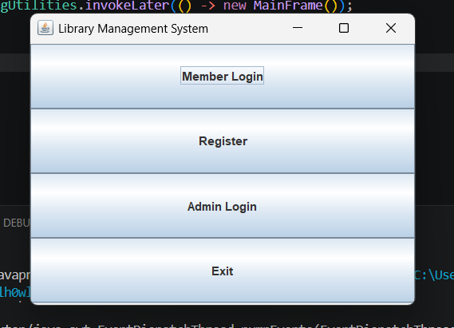
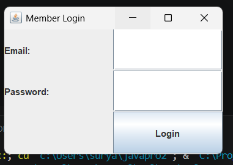
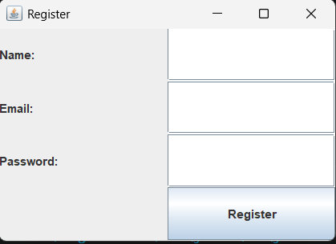
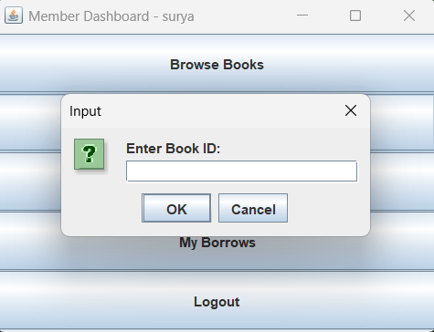
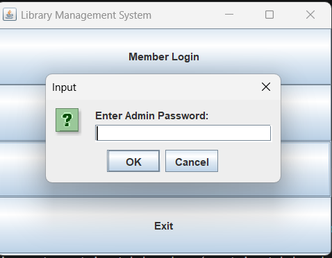

# 📚 Library Management System

A desktop-based library management application built with Java Swing and MySQL. It supports member registration, authentication, book browsing, borrowing and returning, personal borrow history, and an admin console for inventory and borrowing oversight.

## ✨ Project Overview

- **Name:** Library Management System
- **Language:** Java (JDK 21)
- **Type:** Desktop GUI application
- **Purpose:** Help library members manage their account and borrowing activity while giving admins tools to maintain the catalog and monitor all borrow records.

## 🛠️ Tech Stack

- **Java JDK 21**
- **MySQL 8.0** database (`library_db`)
- **JDBC** with **MySQL Connector/J 9.6.0**
- **Java Swing** with AWT layout managers
- **Architecture:** DAO Pattern + Service Layer

## 🏗️ Project Structure

```text
src/
├── main/LibraryMain.java         -> Entry point, launches MainFrame via SwingUtilities.invokeLater
├── db/DBConnection.java          -> JDBC connection to localhost:3306/library_db
├── dto/                          -> Data Transfer Objects
│   ├── BookDTO.java              -> bookId, title, author, genre, totalCopies, availableCopies
│   ├── MemberDTO.java            -> memberId, name, email, password
│   └── BorrowRecordDTO.java      -> recordId, memberId, bookId, borrowDate, dueDate, returnDate, status
├── dao/                          -> Interfaces
│   ├── BookDAO.java              -> addBook, getAllBooks, getBookById, updateAvailableCopies
│   ├── MemberDAO.java            -> registerMember, loginMember
│   └── BorrowDAO.java            -> isBookAvailable, borrowBook (returns generated ID), returnBook, getBorrowsByMember, getAllBorrows
├── daoimpl/                      -> JDBC implementations of DAO interfaces
│   ├── BookDAOImpl.java
│   ├── MemberDAOImpl.java
│   └── BorrowDAOImpl.java
├── service/                      -> Business logic layer
│   ├── BookService.java
│   ├── MemberService.java
│   ├── BorrowService.java        -> handles availability check + 14-day due date calculation
│   └── AdminService.java
└── ui/                           -> Swing GUI frames
    ├── MainFrame.java            -> Entry screen: Member Login, Register, Admin Login, Exit
    ├── MemberLoginFrame.java     -> Email + password login
    ├── RegisterFrame.java        -> New member registration
    ├── MemberDashboardFrame.java -> Member home screen
    ├── BrowseBooksFrame.java     -> View all books with availability
    ├── MyBorrowsFrame.java       -> Member's borrow history with return action
    └── AdminDashboardFrame.java  -> Add books, view all books, view all borrow records

lib/
└── mysql-connector-j-9.6.0.jar

bin/           -> Compiled .class files (same package structure as src/)
screenshots/   -> UI screenshots
schema.sql     -> SQL to create library_db and all 3 tables
build.ps1      -> PowerShell build script
build.bat      -> Batch build script
run.ps1        -> PowerShell run script
run.bat        -> Batch run script
CLASSPATH.md   -> Notes on classpath configuration
```

## 🧠 Architecture Flow

```text
DTO -> DAO Interface -> DAOImpl -> Service -> UI

MemberDTO / BookDTO / BorrowRecordDTO
    ↓
BookDAO / MemberDAO / BorrowDAO
    ↓
BookDAOImpl / MemberDAOImpl / BorrowDAOImpl
    ↓
BookService / MemberService / BorrowService / AdminService
    ↓
Swing UI Frames
```

## 🗄️ Database Schema

The application uses a MySQL database named `library_db` with three tables:

```sql
CREATE DATABASE library_db;
USE library_db;

CREATE TABLE members (
    member_id INT PRIMARY KEY AUTO_INCREMENT,
    name VARCHAR(100),
    email VARCHAR(100) UNIQUE,
    password VARCHAR(100)
);

CREATE TABLE books (
    book_id INT PRIMARY KEY AUTO_INCREMENT,
    title VARCHAR(200),
    author VARCHAR(100),
    genre VARCHAR(100),
    total_copies INT DEFAULT 1,
    available_copies INT DEFAULT 1
);

CREATE TABLE borrow_records (
    record_id INT PRIMARY KEY AUTO_INCREMENT,
    member_id INT,
    book_id INT,
    borrow_date DATE,
    due_date DATE,
    return_date DATE,
    status VARCHAR(20),
    FOREIGN KEY (member_id) REFERENCES members(member_id),
    FOREIGN KEY (book_id) REFERENCES books(book_id)
);
```

## ✨ Features

### Member Module

- Register new account with name, email, and password
- Login with email and password using case-sensitive comparison
- Browse the full book catalog with availability
- Borrow available books with automatic 14-day due date calculation
- Return borrowed books and restore inventory counts
- View personal borrow history with `BORROWED` and `RETURNED` status
- Access a member dashboard with quick action buttons

### Admin Module

- Login through a password-protected dialog using `admin123`
- Add new books with title, author, genre, and total copies
- View the complete book inventory
- Monitor all borrow records across all members in a table
- Log out back to the main menu

## ⚙️ Key Implementation Details

- Duplicate borrow prevention is enforced by `BorrowDAO.isBookAvailable()` before a borrow is created.
- Inventory changes are centralized through `BookDAO.updateAvailableCopies()` with `-1` on borrow and `+1` on return.
- Due dates are calculated with `LocalDate.now().plusDays(14)` and persisted using `Date.valueOf()`.
- `Statement.RETURN_GENERATED_KEYS` is used in `borrowBook()` to return the new `record_id`.
- All JDBC work uses try-with-resources for `Connection`, `PreparedStatement`, and `ResultSet`.
- Password checks use `BINARY` in SQL to keep member authentication case-sensitive.
- UI startup is wrapped in `SwingUtilities.invokeLater()` to keep Swing threading correct.

## 📸 Screenshots

| Screen | Preview |
|---|---|
| Main menu |  |
| Member login |  |
| Member registration |  |
| Book browse / member dashboard |  |
| Admin dashboard |  |

## 🔑 Default Credentials

| Role | Access Method | Credentials |
|---|---|---|
| Admin | JOptionPane password prompt | `admin123` |
| Member | Register through the UI | Create your own email and password |

## 🚀 Setup Instructions

### Prerequisites

- JDK 17 or higher, tested on JDK 21
- MySQL 8.0 running locally
- VS Code with Extension Pack for Java

### Steps

1. Clone the repository.
2. Run `schema.sql` on MySQL to create the database and tables:

```bash
mysql -u root -p < schema.sql
```

3. Update `src/db/DBConnection.java` and set your MySQL password:

```java
private static final String PASS = "your_mysql_password";
```

4. Keep `mysql-connector-j-9.6.0.jar` in the `lib/` folder. It is already included in this project.
5. Build the project with one of the provided scripts:

```powershell
.\build.ps1
```

```bat
build.bat
```

6. Run the application:

```powershell
.\run.ps1
```

```bat
run.bat
```

### Manual Commands

```bash
javac -d bin -cp "lib\*" src\**\*.java
java -cp "bin;lib\*" main.LibraryMain
```

## 🧩 Troubleshooting

### MySQL driver not found

- Confirm the JAR is present in `lib/`.
- Make sure the classpath includes `lib\*` during both build and run.

### Connection failed

- Check that MySQL is running locally.
- Verify the password in `DBConnection.java`.
- Confirm that `library_db` exists and `schema.sql` has been executed.

### ClassNotFoundException

- Rebuild the project with `build.ps1` or `build.bat`.
- If needed, delete `bin/` and rebuild from scratch.

### UI does not appear

- Confirm `SwingUtilities.invokeLater()` is used in `LibraryMain.java`.
- Verify the Swing classes are being launched from `ui.MainFrame`.

## 🛠️ Future Enhancements

- BCrypt password hashing
- Advanced book search by title, author, and genre
- Overdue fine calculation
- Email notifications for due dates
- Migration to a Spring Boot REST API
- JavaFX modern UI
- Book reservation system
- Analytics and reports dashboard
- Member book ratings and reviews

## 📝 Metadata

| Field | Value |
|---|---|
| Version | 1.0.0 |
| Status | Fully Functional |
| Last Updated | May 2, 2026 |
| License | MIT |

## 📦 License

This project is licensed under the MIT License.

## 📦 License

This project is licensed under the MIT License.
